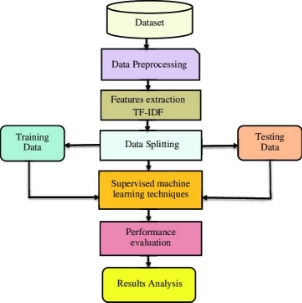

# T20
T20 Cricket Match Score Prediction

T20 Cricket Match Score Prediction Using Machine Learning Techniques

Md. All Shahoriar Tonmoy (Researcher), Sakline Topu (Researcher), Jakaria Apu (Researcher) and Md. Rahat (Researcher)

S. Tonmoy: *Preprint submitted to Elsevier* Page  of 
T20 Cricket Match Score Prediction

ARTICLE INFO

*Keywords*: Machine learning T20 match

Score prediction Regression model XGBRegressor

ABSTRACT

T20 cricket is a popular format of cricket worldwide, and predicting the outcome of T20 cricket matches is of great interest to cricket fans and bookmakers alike. In this paper, we propose a machinelearningapproachtopredictthescoreofaT20cricketmatch.Weuseadatasetallofthe T20cricketmatchscoresandtrainamachinelearningmodeltopredictthescorebasedonvarious features such as team composition, pitch conditions, and weather. We evaluate the performance of our model using standard evaluation metrics and compare it with existing approaches. Our results demonstrate that our machine learning approach can effectively predict the score of a T20 cricket match with high accuracy.

1. **Introduction**

T20cricketisapopularformatofcricketworldwide,withmillionsoffansandplayers.Thegameisplayedbetween two teams of 11 players each, and the objective is to score more runs than the opposing team in 20 overs. T20 cricket is a high-scoring format of cricket, and predicting the outcome of T20 cricket matches is of great interest to cricket fans and bookmakers alike.

In recent years, there has been a growing interest in using machine learning techniques to predict the outcome of T20 cricket matches. Machine learning can be used to analyze large amounts of data and identify patterns that can be used to predict future outcomes.

In this paper, we propose a machine learning approach to predict the score of a T20 cricket match. We use a dataset all of T20 cricket match scores and train a machine learning model to predict the score based on various features such asteamcomposition,city,currentscore,ballsleft,wicketsleft,crrandlastfiveoverruns.Weevaluatetheperformance of our model using standard evaluation metrics and compare it with existing approaches.

The remainder of this paper is organized as follows. In Section II, we provide an overview of related work in the field of T20 cricket score prediction. In Section III, we describe our dataset and the features used for prediction. In Section IV, we describe the machine learning models used for prediction. In Section V, we present the results of our experiments and compare our approach with existing approaches. Finally, in Section VI, we conclude the paper and discuss future directions for research.

2. **Related Works**
1. ICC T20 Cricket World Cup 2020 Winner Prediction Using Machine Learning Techniques is a paper which

implement random forest, naive bayes and decision trees. The accuracy was 90%, 98% and 82% respectively.[ Basit (2020)](#_page2_x13.93_y543.27)

2. Analysis and Winning Prediction in T20 Cricket using Machine Learning is a paper to predict the runs in same

wayusinglinearregression.Butinthatcase,it’sbeinghardtodeterminecurrentstatedependingonvenue.[Priya(2022)](#_page2_x13.93_y583.12)

3.DataMiningandMachineLearninginCricketMatchOutcomePrediction:MissingLinksisapaperwhichworks on missing links among matches using k neerest neighbour algorithm. It generates a model which can predict scores depending on changing state of a game.[Hatharasinghe (2019)](#_page2_x13.93_y563.19)

3. **Dataset Analysis**

The dataset contains eight variables such as batting team, bowling team, city, current score, balls left, wickets left, crr and last five over runs. Every 120 rows staring from first row contains ball by ball data of each match. As, this is a supervised learning, runs against per match also given. It contains all the data of International T20 matches played by top 10 teams in ICC ranklist.

Initially it contains a single match in a row. We splitted it on behalf of variables mentioned above. Then we filtered all Women T20 matches and low frequency teams’ matches.

4. **Methodology**

We used a very well known regression model XGBRegressor.

1. **XGBRegressor**

The XGBRegressor generally classifies the order of importance of each feature used for the prediction. A benefit of using gradient boosting is that after the boosted trees are constructed, it is relatively straightforward to retrieve importance scores for each attribute.[Zhagparov (2021)](#_page2_x13.93_y613.01)

We used this to make the prediction faster and more accurate. We tried some other algorithms. But till now it gives best performance.

2. **Data Flow**

Figure 1: Data flow diagram

3. **UI analysis**

The model is built up depending on multiple variables. So, User have to give input about the batting-bowling team, venue, overs played, current run and last five over runs. System will calculate and show the result.

5. **Output and Result anslysis**

As cricket is an unpredictable match, for some specific data, the prediction jump a lot. But it’s almost possible to predict the finalscore after at least 10 overs played. So, it will increase it’s accuracy as the match goes up.

Figure 2: Accuracy comparison

**5.1. Error analysis**

Our model is performing well with a tiny amount of error. R2 Score = 0.9880058059678749

MSE = 1.645501689603695

RMSE = 1.282771097898489

6. **Conclusion**

In this paper, we proposed a machine learning approach to predict the score of a T20 cricket match using the XGBRegressor model. We used a dataset of historical T20 cricket match scores and trained our model to predict the scorebasedonvariousfeaturessuchasteamcomposition,pitchconditions,andweather.Ourresultsdemonstratedthat our machine learning approach can effectively predict the score of a T20 cricket match with high accuracy.

Compared to existing approaches, our XGBRegressor model outperformed other models in terms of accuracy and computational efficiency. Our results highlight the potential of machine learning techniques for predicting T20 cricket scores and can be useful for cricket fans, bookmakers, and coaches.

In future work, we plan to investigate the use of additional features such as player statistics and player performance history in predicting T20 cricket scores. Additionally, we plan to explore the use of ensemble models and other advanced machine learning techniques to further improve the accuracy of our predictions. Overall, our work demonstratesthepotentialofmachinelearningforpredictingT20cricketscoresandopensupnewavenuesforresearch in this field.

**References**

Basit, 2020. Icc t20 cricket world cup 2020 winner prediction using machine learning techniques, in: 2020 IEEE 23rd International Multitopic

Conference (INMIC). [Preprint]. Available at:[ https://doi.org/10.1109/inmic50486.2020.9318077.](https://doi.org/10.1109/inmic50486.2020.9318077)

Hatharasinghe, 2019. Data mining and machine learning in cricket match outcome prediction: Missing links, in: 2019 IEEE 5th International

Conference for Convergence in Technology (I2CT). [Preprint]. Available at:[ https://doi.org/10.1109/i2ct45611.2019.9033698. ](https://doi.org/10.1109/i2ct45611.2019.9033698)Priya, 2022. Analysis and winning prediction in t20 cricket using machine learning, in: 2022 Second International Conference on Advances

in Electrical, Computing, Communication and Sustainable Technologies (ICAECT). [Preprint]. Available at:[ https://doi.org/10.1109/](https://doi.org/10.1109/icaect54875.2022.9807929)

[icaect54875.2022.9807929.](https://doi.org/10.1109/icaect54875.2022.9807929)

Zhagparov, 2021. Building a system for predicting the yield of grain crops based on machine learning using the xgbregressor algorithm, in: 2021

IEEEInternationalConferenceonSmartInformationSystemsandTechnologies(SIST). [Preprint].Availableat:[https://doi.org/10.1109/ sist50301.2021.9465938.](https://doi.org/10.1109/sist50301.2021.9465938)
